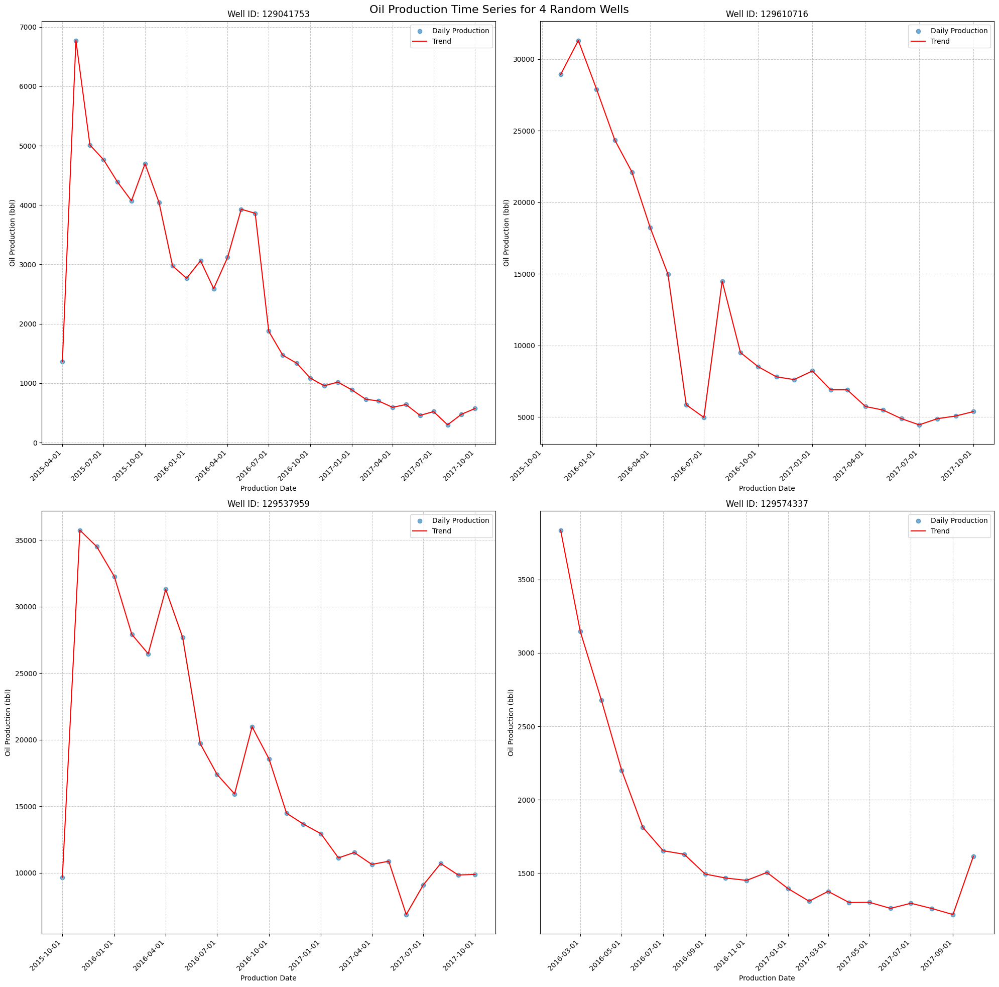
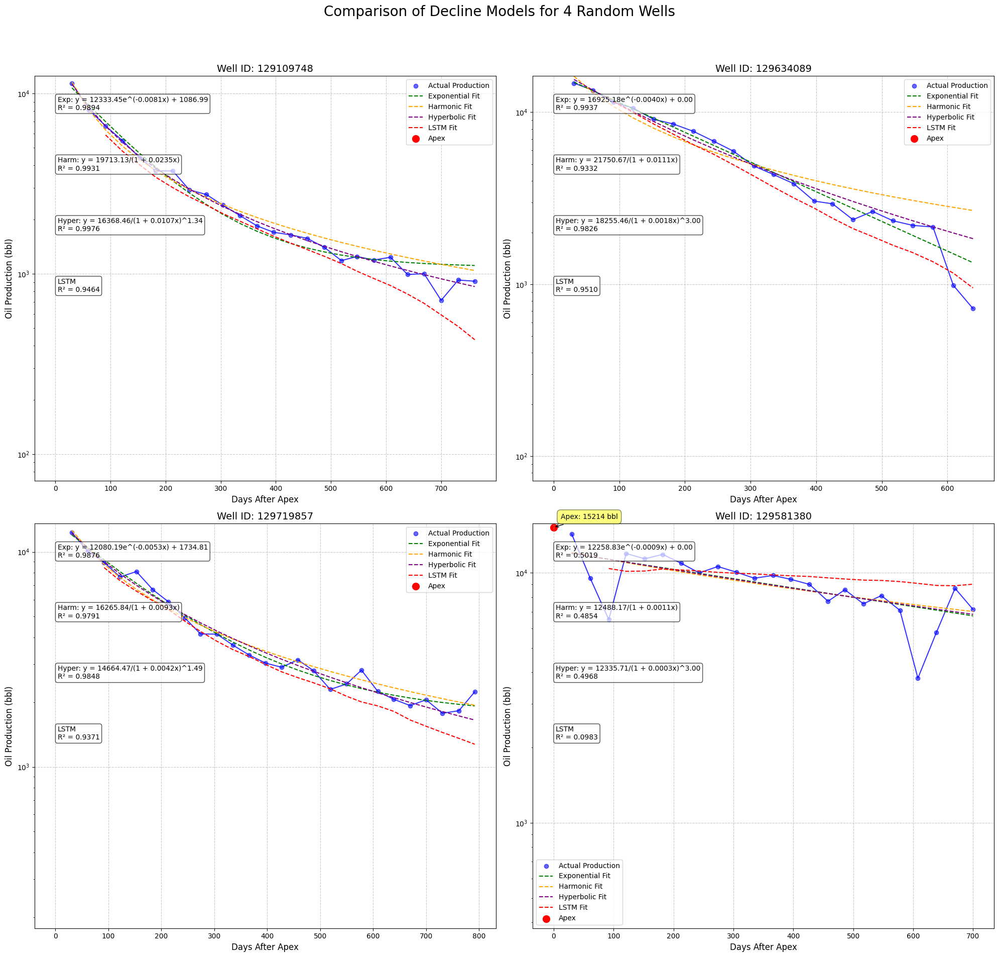
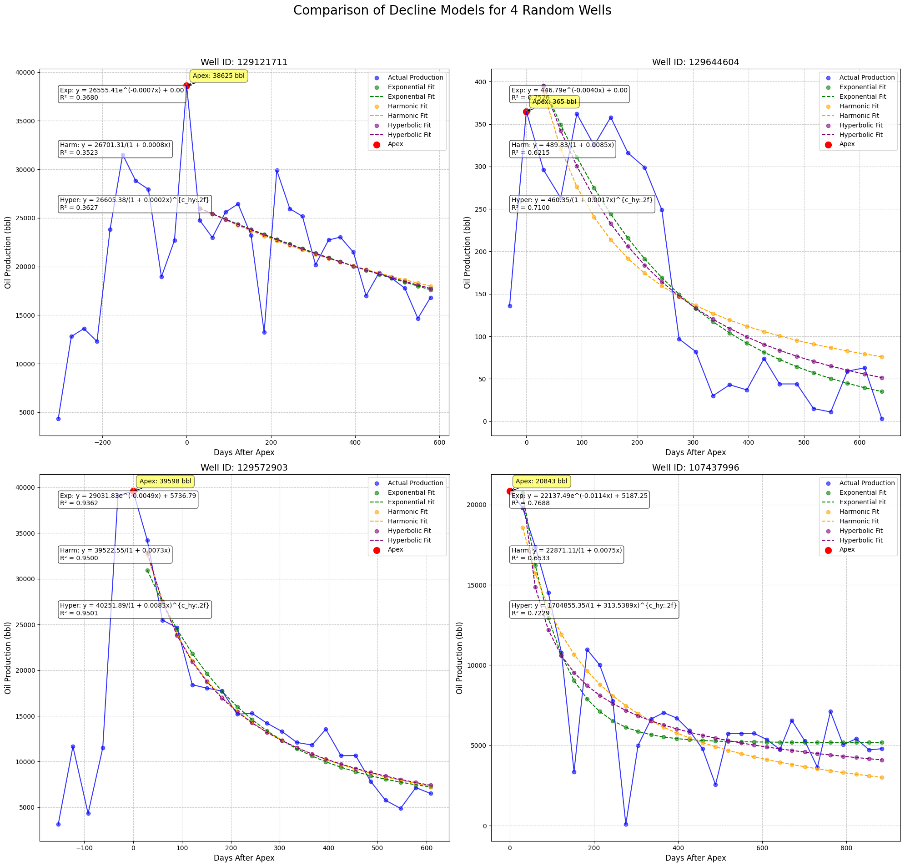
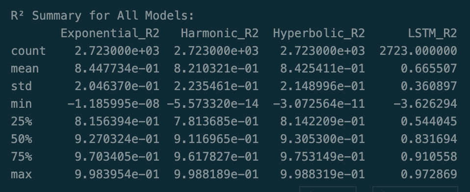

# Advanced Decline Curve Analysis (DCA) for Oil Production



This project implements advanced Decline Curve Analysis (DCA) techniques to analyze and predict oil production rates over time. It combines traditional DCA models with machine learning approaches to provide comprehensive insights into well performance.

## Table of Contents
1. [Introduction](#introduction)
2. [Requirements](#requirements)
3. [Data Preparation](#data-preparation)
4. [Models](#models)
5. [Results](#results)

## Introduction

Decline Curve Analysis is a crucial technique in the oil and gas industry for forecasting future production rates and estimating ultimate recoverable reserves. This project extends traditional DCA methods by incorporating machine learning models to potentially improve prediction accuracy.



## Requirements

To run this analysis, you'll need the following Python libraries:

- numpy
- pandas
- scipy
- matplotlib
- torch (PyTorch)
- scikit-learn

You can install these libraries using pip:

```pip install numpy pandas scipy matplotlib torch scikit-learn```


## Data Preparation

The analysis requires a CSV file containing production data with the following columns:
- `well_id`: Unique identifier for each well
- `production_days_after_apex`: Days since the peak production (apex)
- `oil_bbl`: Daily oil production in barrels

Ensure your data is cleaned and formatted correctly before running the analysis.

## Models

This project implements and compares four different models:

1. **Exponential Decline**: y = ae^(-bx) + c
2. **Harmonic Decline**: y = a / (1 + bx)
3. **Hyperbolic Decline**: y = a / (1 + bx)^c
4. **LSTM (Long Short-Term Memory)**: A deep learning model for sequence prediction



The LSTM model uses both the actual production data and the exponential decay predictions as inputs, potentially capturing more complex decline patterns.

## Results

The script generates plots comparing the performance of all four models for randomly selected wells. It also provides a summary of R² scores for each model across all wells.



The results allow for a comprehensive comparison of traditional DCA methods with advanced machine learning techniques, helping to identify the most accurate prediction model for different well characteristics.

---

For more details on the implementation and usage, please refer to the code comments and docstrings.